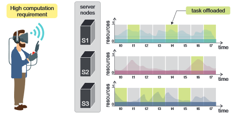

# genMarkov

This repository contains companion codes for the research paper:
*Test-bench for Task Offloading Mechanisms: Modelling the Rewards of Non-stationary Nodes*.

## Usage

The code uses `numpy`, `scipy` and `matplotlib` as dependencies. You need to install
those first using `pip` or any other installer.

The project consists of mainly 3 files:
- **chain.py**: Generates a Markov chain
- **markov.py**: Produces a Markov model with given mu, sigma and N states
- **utils.py**: Utility functions for the project

You can use those by running `python3 <name_of_the_file>`. To observe the end
result, run `python3 chain.py`.

## License
[View License](https://github.com/Aniq55/genMarkov/blob/master/LICENSE.md)

## Contributing
Any form of contributing is welcome, however the contribution should be compliant
with our license.
